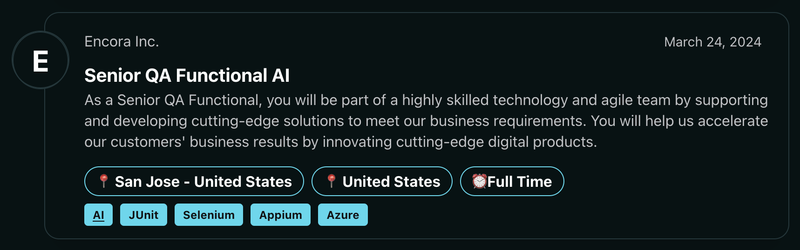
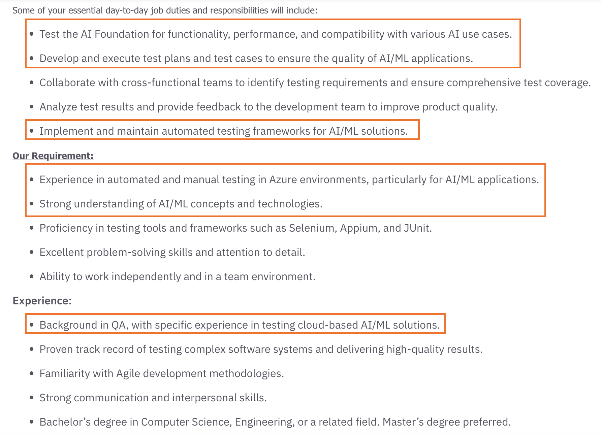
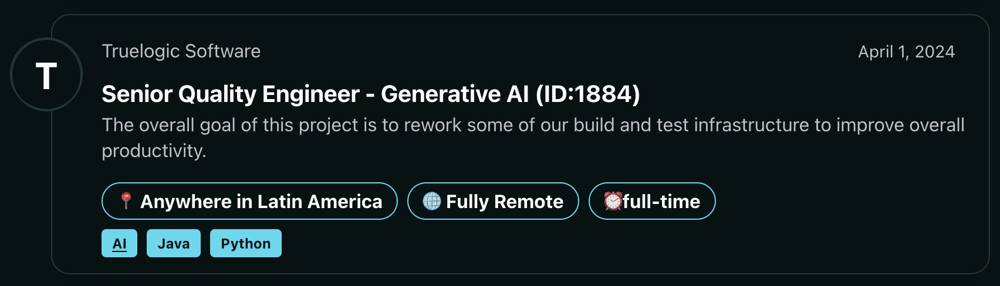
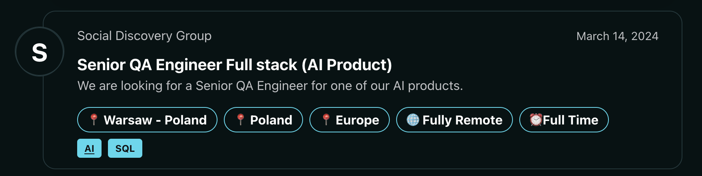

# 🛣️ AI Test Engineer Job Description

Insights into potential career trajectories and specializations within AI testing.

## Types of AI Testing Jobs

* **AI QA Engineer:** Focus on functional testing. Similar to traditional QA roles, but with an understanding of AI system behavior.
* **AI Test Automation Engineer:** Develop automated testing solutions specifically for AI models and their integration into larger systems.
* **Data Quality Assurance for AI:** Ensure the data used to train AI models is accurate, comprehensive, and bias-free.
* **Performance Testing for AI:** Make sure AI systems can scale and handle high workloads as usage increases.

## Key Skills for AI Testing Jobs
* **Testing Fundamentals:** Strong understanding of testing principles, methodologies, and test case design.
* **AI/ML Knowledge:** Understand how AI models are built, trained, and deployed. This includes concepts like supervised/unsupervised learning, neural networks, etc.
* **Data Science:** Ability to understand, analyze, and prepare data used in AI development.
* **Programming:** Proficiency in languages like Python is often necessary for automation and scripting.

## Where to Find AI Testing Jobs
* **Specialized Job Boards:**
   * [https://ai-jobs.net/list/testing-related-jobs/](https://ai-jobs.net/list/testing-related-jobs/)
   * TestDevJobs: [https://testdevjobs.com/tag/ai-testing-jobs/](https://testdevjobs.com/tag/ai-testing-jobs/)
* **General Job Boards:** 
   * Indeed: [https://www.indeed.com](https://www.indeed.com)
   * LinkedIn: [https://www.linkedin.com/jobs](https://www.linkedin.com/jobs)
   * SimplyHired: [https://www.simplyhired.com/search?q=ai+tester](https://www.simplyhired.com/search?q=ai+tester)
* **Company Websites:** Look at tech companies heavily invested in AI.

## Sample Job Posts

