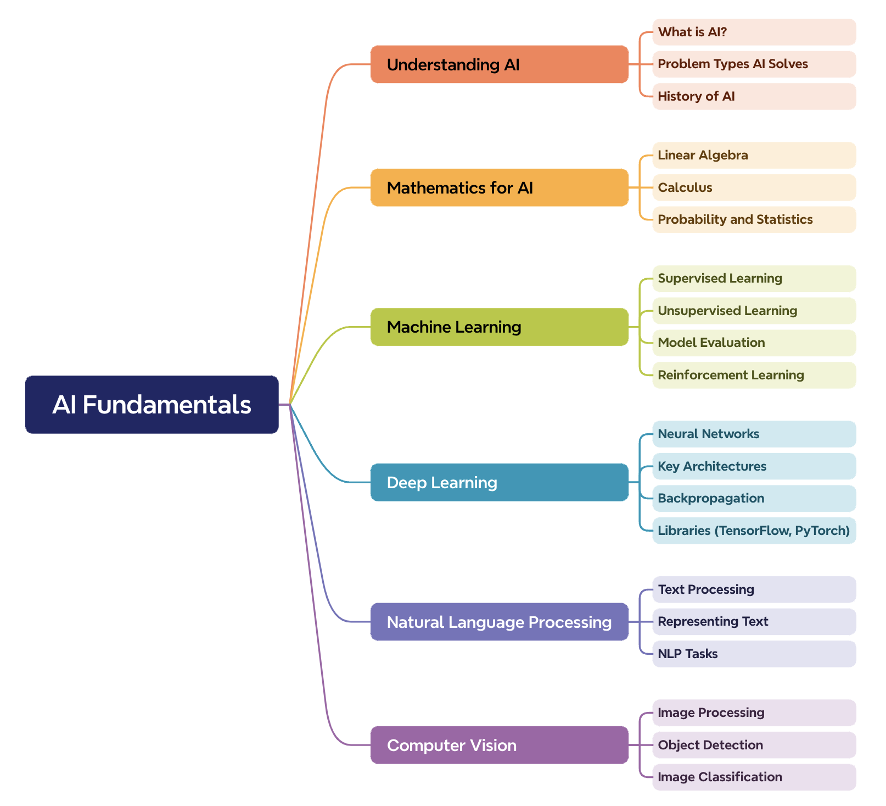

# Introduction

Here's a roadmap to guide you on your journey towards becoming an AI Test Engineer. Remember, this is adaptable based on your existing knowledge and experience.

## Phase 1: Laying the Groundwork

### 1. Software Testing Foundations:

### 📝 See Details: [Software Testing Roadmap](software-testing-roadmap.md)

-------------------

### 2. Using Generative AI for Software Testing

### 📝 See Details: [Generative AI Roadmap](generative-ai-software-testing.md)

-------------------

### 3. Understanding AI Fundamentals

### 📝 See Details: [AI Fundamentals Roadmap](ai-fundamentals-roadmap.md)

-------------------

### 4. Exploring the LLMs World

### 📝 See Details: [The LLM World](exploring-llm-world.md)

-------------------

### 5. Programming Proficiency

### 📝 See Details: [Learn Python & JS](programming-proficiency.md)
-------------------

## Phase 2: Specializing in AI Testing

### Data Quality and Preparation
* **Data bias:** Identifying and mitigating bias in datasets.
* **Data cleaning and preprocessing:**  Ensuring data is suitable for AI models.

### Model Evaluation & Metrics:
* **Accuracy, Precision, Recall, F1-score:**  Understanding when to use which metric.
* **ROC Curves, Confusion Matrices:** Visualizing model performance. 
* **Overfitting/Underfitting:**  Diagnosing and addressing these problems. 

### AI-Specific Testing Challenges
* **Explainability:** Testing the reasoning behind AI decisions.
* **Robustness:** Testing how models handle unexpected or adversarial inputs.
* **Fairness:** Ensuring AI systems don't perpetuate discrimination.

-------------------

## Phase 3: Building Experience and Expertise

### Certifications:
* [ISTQB® Certified Tester, Foundation Level – AI Testing](https://www.istqb.org/certifications/artificial-inteligence-tester)
   * [YouTube: ISTQB AI TESTER 2023](https://www.youtube.com/playlist?list=PLj5VKaW115t1h61dS81yz-86AKpe_Yq1f)
   * [ISTQB Certified Tester AI Testing Explained](https://www.youtube.com/playlist?list=PL8Ql2_5rYPjgK0HDswJeqpATbOJ7xaGkR)
* [Microsoft Certified: Azure AI Fundamentals](https://learn.microsoft.com/en-us/credentials/certifications/azure-ai-fundamentals/?practice-assessment-type=certification)
   * [YouTube: Azure AI Fundamentals Certification 2024 (AI-900) - Full Course to PASS the Exam](https://www.youtube.com/watch?v=hHjmr_YOqnU) 

### Practice Projects:
* **Open Datasets:** Find datasets on sites like Kaggle and UCI Machine Learning Repository.
* **Open-source AI projects:** Contribute to testing aspects of existing projects.

### Networking and Community:
* **Online Forums:** Interact, learn, and find potential leads.
* **Conferences and Meetups:**  Stay up-to-date and build connections.

### Portfolio Development:
* **Document projects:** Showcase your testing strategies, results, and insights.
* **GitHub Profile:** Share your code and contributions.

## Important Additional Skills:

* **Cloud Computing:**  Knowledge of platforms like AWS, Azure, or GCP.
* **Visual Testing:** Understanding visual testing techniques for UI-based AI systems
* **Critical Thinking:**  The ability to analyze problems and design creative test scenarios
* **Communication Skills:** Practice explaining technical concepts clearly to stakeholders.

**Remember:** Becoming an AI Test Engineer takes time and dedication. This roadmap provides a framework; your commitment and hard work will drive your success!