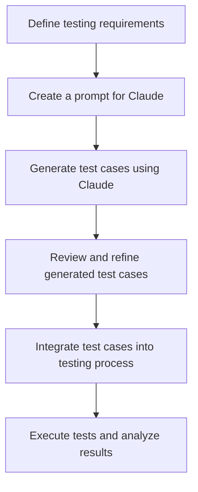
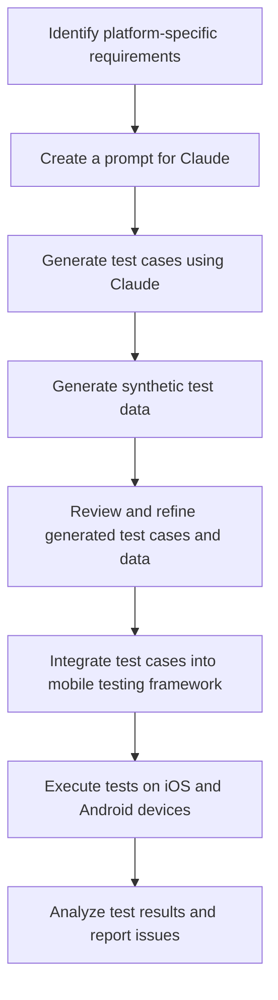
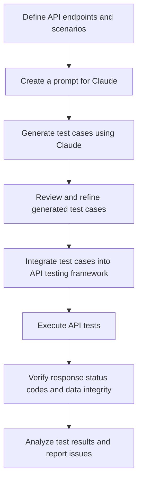
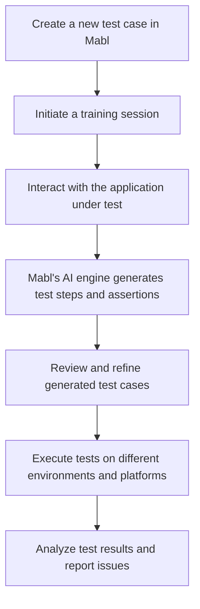

- [Introduction](#introduction)
- [Understanding Generative AI in Software Testing](#understanding-generative-ai-in-software-testing)
- [Using Claude for Generating Test Cases](#using-claude-for-generating-test-cases)
- [Web Application Testing with Generative AI](#web-application-testing-with-generative-ai)
- [Mobile Application Testing (iOS \& Android)](#mobile-application-testing-ios--android)
- [API Testing with Generative AI](#api-testing-with-generative-ai)
- [Integrating Generative AI with Testing Tools](#integrating-generative-ai-with-testing-tools)
- [Challenges and Considerations](#challenges-and-considerations)
- [Future Trends and Opportunities](#future-trends-and-opportunities)
- [Conclusion](#conclusion)

## Introduction

In the rapidly evolving landscape of software development, ensuring the quality and reliability of our applications has become more critical than ever. As we strive to deliver exceptional user experiences across various platforms, including web, mobile, and APIs, the need for efficient and comprehensive testing methods has grown exponentially. This is where generative AI comes into play, revolutionizing the way we approach software testing. 🚀

In this educational material, we will explore the exciting world of generative AI and its transformative impact on software testing. We will focus on leveraging Claude, an advanced AI assistant, to generate test cases for web applications, mobile apps (iOS and Android), and APIs. By harnessing the power of generative AI, we can significantly enhance our testing processes, improve test coverage, and ultimately deliver higher-quality software to our users. 💻

## Understanding Generative AI in Software Testing

Before we dive into the practical applications of generative AI in testing, let's take a moment to understand the core concepts and techniques behind this technology. Generative AI differs from traditional testing methods in that it utilizes advanced algorithms and models to generate new and diverse test cases based on patterns and insights learned from existing data. 🧠

Two key generative AI models that have gained prominence in the testing domain are Generative Adversarial Networks (GANs) and Transformers. GANs consist of two neural networks, a generator and a discriminator, that work together to create realistic test data. Transformers, on the other hand, excel at understanding the context and sequence of data, enabling them to generate coherent and relevant test cases. 🌐

## Using Claude for Generating Test Cases

Now, let's explore how we can leverage Claude, a powerful AI assistant, to generate test cases for our software projects. When using Claude, it's essential to follow best practices and techniques to ensure the generated test cases are relevant, comprehensive, and aligned with our testing goals. 📝

One crucial aspect to keep in mind is maintaining confidentiality. We must refrain from inputting sensitive company information into Claude or any other AI tool. Instead, we can structure our prompts in a way that provides the necessary context and requirements without disclosing confidential details. 🔒

Here's an example prompt for generating test cases for a web application's user registration flow:

```
"Generate test cases for a user registration flow on a web application. The test cases should cover various scenarios, including valid and invalid input combinations, field validations, and error handling. Ensure the test cases consider different user roles and edge cases. Do not include any confidential company information in the test cases."
```

Claude can generate a set of test cases based on this prompt, covering a wide range of scenarios and edge cases. We can then review and refine the generated test cases to ensure they align with our specific requirements and testing objectives. ✅

## Web Application Testing with Generative AI

Generative AI can significantly streamline the process of testing web applications. By leveraging tools like Claude, we can generate comprehensive test cases that cover various scenarios, including edge cases and boundary conditions. 🌍

Let's consider an example where we want to test a user registration flow on a web application. We can use Claude to generate test cases by providing a prompt that outlines the desired scenarios and constraints. For instance:

```
"Generate test cases for a user registration flow on a web application. The test cases should cover the following scenarios:

1. Valid user registration with all required fields filled correctly
2. Invalid user registration with missing required fields
3. Invalid user registration with already existing username or email
4. Password strength validation (e.g., minimum length, special characters)
5. Error handling and appropriate error messages for invalid inputs

Ensure the test cases consider different user roles (e.g., admin, regular user) and edge cases. Do not include any confidential company information in the test cases."
```

Based on this prompt, Claude can generate a set of test cases that cover the specified scenarios. We can then review the generated test cases, refine them if necessary, and integrate them into our testing process. 🚀



## Mobile Application Testing (iOS & Android)

Testing mobile applications presents unique challenges due to the diverse range of devices, screen sizes, and operating system versions. Generative AI can help us tackle these challenges by generating platform-specific test cases and test data. 📱

When testing mobile apps, it's crucial to consider the specific requirements and constraints of each platform. For example, iOS and Android have different user interface guidelines and system behaviors that need to be accounted for in our test cases. 🍎🤖

Let's take an example of testing an e-commerce mobile app. We can use Claude to generate test cases for various scenarios, such as:

1. User registration and login
2. Product search and filtering
3. Adding products to the cart
4. Checkout process
5. Order tracking and history

To generate relevant test cases, we can provide Claude with a prompt that includes platform-specific requirements and edge cases. For instance:

```
"Generate test cases for an e-commerce mobile app on both iOS and Android platforms. The test cases should cover the following scenarios:

1. User registration and login with valid and invalid credentials
2. Product search and filtering based on various criteria (e.g., price range, category)
3. Adding products to the cart and modifying quantities
4. Checkout process with different payment methods and shipping options
5. Order tracking and history for both guest and registered users

Consider platform-specific UI guidelines and system behaviors when generating the test cases. Ensure the test cases cover edge cases, such as network interruptions and low storage scenarios. Do not include any confidential company information in the test cases."
```

In addition to generating test cases, Claude can also help us generate synthetic test data for mobile app testing. This includes generating user profiles, product data, and other relevant information required for comprehensive testing. 📊



## API Testing with Generative AI

API testing is crucial for ensuring the reliability and performance of our software systems. Generative AI can assist us in generating test cases for various API endpoints and scenarios, enabling thorough testing of our APIs. 🔌

When testing APIs, we need to consider different HTTP methods (e.g., GET, POST, PUT, DELETE), request payloads, and response formats. We can use Claude to generate test cases that cover these aspects and validate the expected behavior of our APIs. 🌐

Let's consider an example of testing a RESTful API for a blog application. We can provide Claude with a prompt that outlines the desired test scenarios:

```
"Generate test cases for a RESTful API of a blog application. The test cases should cover the following endpoints and scenarios:

1. GET /posts: Retrieve a list of blog posts
   - Test with various query parameters (e.g., pagination, sorting)
   - Verify the response structure and data integrity

2. GET /posts/{id}: Retrieve a specific blog post by ID
   - Test with valid and invalid post IDs
   - Verify the response structure and data integrity

3. POST /posts: Create a new blog post
   - Test with valid and invalid request payloads
   - Verify the response status code and the created post's data

4. PUT /posts/{id}: Update an existing blog post
   - Test with valid and invalid post IDs and request payloads
   - Verify the response status code and the updated post's data

5. DELETE /posts/{id}: Delete a blog post
   - Test with valid and invalid post IDs
   - Verify the response status code and the post's deletion

Generate test cases for both positive and negative scenarios, including edge cases and error handling. Ensure the test cases cover different user roles and authentication scenarios. Do not include any confidential company information in the test cases."
```

Claude can generate a comprehensive set of test cases based on this prompt, covering various endpoints, request/response scenarios, and edge cases. We can then integrate these test cases into our API testing framework and automate the execution process. 🚀



## Integrating Generative AI with Testing Tools

To maximize the benefits of generative AI in software testing, we can integrate AI-powered tools into our existing testing ecosystem. Popular tools like Applitools, Mabl, and Testim offer seamless integration with generative AI capabilities, enabling us to streamline our testing processes. 🛠️

For example, Mabl is an AI-powered test automation platform that allows us to create, execute, and maintain tests efficiently. By leveraging Mabl's generative AI features, we can automatically generate test cases based on our application's behavior and user flows. 🤖

Here's a step-by-step example of using Mabl for automated testing with generative AI:

1. Create a new test case in Mabl and initiate a training session.
2. Interact with the application under test, performing the desired user actions.
3. Mabl's AI engine observes and learns from the interactions, generating test steps and assertions automatically.
4. Review and refine the generated test cases, adding additional assertions or modifying the test flow if needed.
5. Execute the generated test cases on different environments and platforms, leveraging Mabl's cross-browser and cross-device testing capabilities.

By combining generative AI with traditional testing tools, we can achieve higher test coverage, reduce manual effort, and accelerate our testing cycles. ⚡



## Challenges and Considerations

While generative AI offers numerous benefits for software testing, it's essential to be aware of its limitations and consider the ethical implications of using AI in our testing processes. 🤔

One potential challenge is that generative AI models may struggle to understand the full context and nuances of complex software systems. They may generate test cases that are syntactically correct but lack the deeper understanding of the application's business logic and user expectations. Therefore, it's crucial to review and validate the generated test cases to ensure they align with our testing goals and cover the necessary scenarios. 🔍

Another consideration is the responsible use of AI in testing. We must ensure that the generated test cases are unbiased, inclusive, and do not perpetuate any discriminatory practices. It's essential to have human oversight and judgment throughout the testing process to identify and mitigate any potential biases or ethical concerns. 🌍

## Future Trends and Opportunities

As generative AI continues to advance, we can expect to see even more innovative applications in software testing. Some emerging trends and opportunities include: 🔮

1. Automated test case prioritization: AI models can analyze historical test data and project requirements to prioritize test cases based on their likelihood of revealing defects and their impact on the system.

2. Intelligent test data generation: Generative AI can create realistic and diverse test data sets, including edge cases and complex scenarios, reducing the effort required for manual test data preparation.

3. Continuous learning and adaptation: AI-powered testing tools can continuously learn from the application's behavior, user feedback, and production data to refine and optimize test cases over time.

As software testers, it's essential to stay updated with the latest advancements in generative AI and explore how these technologies can enhance our testing practices. By embracing generative AI and leveraging tools like Claude, we can unlock new possibilities for efficient, comprehensive, and high-quality software testing. 🌟

## Conclusion

Generative AI has the potential to revolutionize the way we approach software testing, enabling us to create more robust, reliable, and user-centric applications. By leveraging the power of tools like Claude, we can generate comprehensive test cases for web apps, mobile apps, and APIs, while ensuring the confidentiality of our company's sensitive information. 🔒

Throughout this educational material, we have explored the core concepts of generative AI, its applications in software testing, and practical examples of using Claude to generate test cases. We have also discussed the integration of generative AI with popular testing tools, the challenges and ethical considerations to keep in mind, and the exciting future trends and opportunities in this field. 🌍

As we move forward, I encourage you to explore and incorporate generative AI into your testing processes. Embrace the power of tools like Claude, experiment with different prompts and scenarios, and continuously refine your approach based on the insights gained. By doing so, you can elevate your testing practices, improve the quality of your software, and deliver exceptional experiences to your users. 🚀

Remember, while generative AI is a powerful tool, it is not a replacement for human expertise and judgment. Collaborate with your team, share knowledge, and leverage the strengths of both human intelligence and artificial intelligence to achieve the best possible outcomes. 🤝

Let's embrace the future of software testing with generative AI and pave the way for a new era of innovation and quality assurance. Happy testing! 🎉