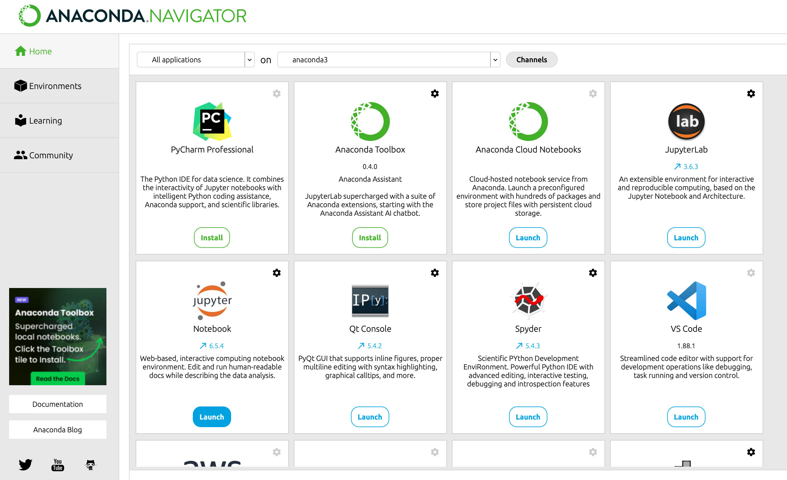
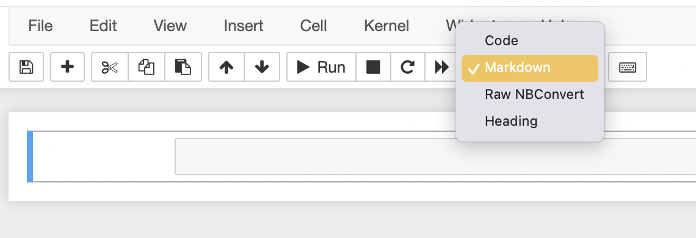
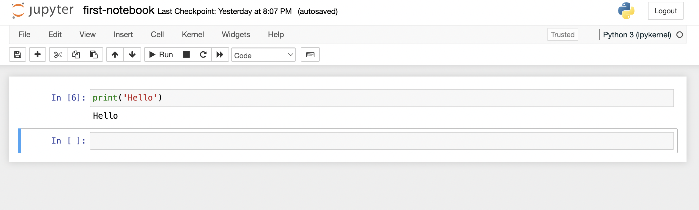
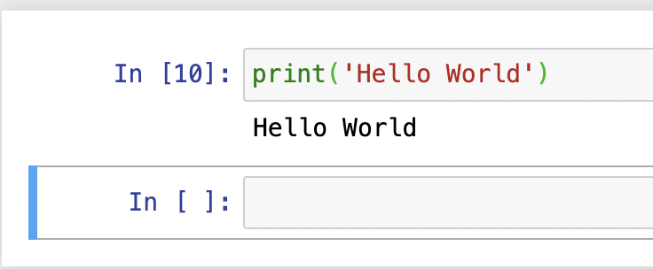
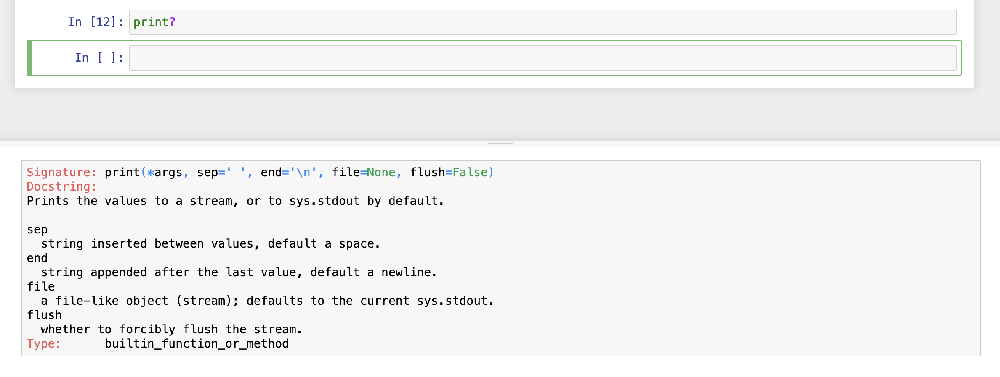
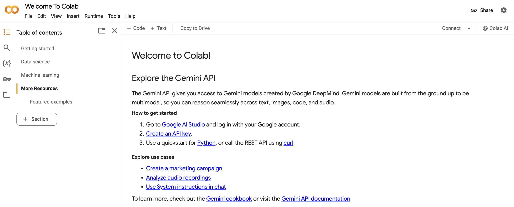
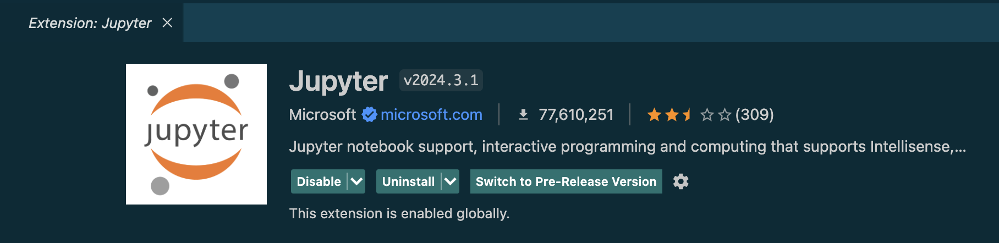
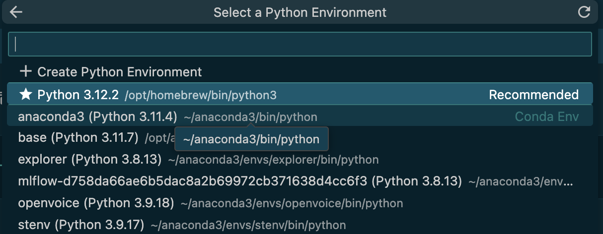
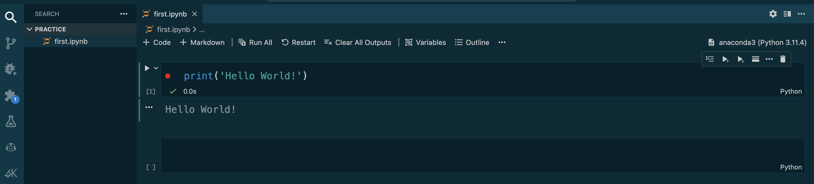

# 🎓 Jupyter Notebooks

## Introduction
Jupyter Notebooks are interactive environments for writing code, especially popular among data scientists and analysts. They allow you to combine code, explanations, and visualizations into a single document, making your work easier to understand and share.

## Getting Started with Jupyter Notebooks

There are three main ways to use the Jupyter Notebooks:

1. **Anaconda:** Anaconda is a popular open-source distribution of the Python and R programming languages used for data science, machine learning, scientific computing, and related tasks. It includes many libraries and tools commonly used in these fields, such as NumPy, pandas, SciPy, Matplotlib, Jupyter Notebook, and many others.
2. **Google Colab:** Google Colab is a free cloud-based Jupyter Notebook environment. 
3. **VS Code:** VS Code is a popular code editor that can be extended to support Jupyter Notebooks. 

## Using Jupyter Notebooks With Anaconda
1. **Download and Install Anaconda:** Download the Anaconda installer from the official website [https://www.anaconda.com/](https://www.anaconda.com/). Follow the installation instructions for your operating system.

2. **Launch Jupyter Notebook:** Once Anaconda is installed, open the Anaconda Navigator application. In the Navigator window, locate "Jupyter Notebook" and click the "Launch" button. A new browser window will open displaying the Jupyter Notebook interface. 

**Important Note:**  When launching Jupyter Notebook through Anaconda, a terminal window might appear in the background. This window, called the notebook server, is essential for running your notebook. It's generally safe to ignore this window as long as your notebook cells are executing without problems. However, keep in mind that closing it might interrupt your notebook session. The appearance of this window may vary depending on your operating system and launch method.

### Creating Your First Notebook

Here's how to create your first notebook:

1. **Create a New Folder (Optional):** It's good practice to organize your notebooks by project. In the file browser on the left side of the Jupyter Notebook interface, navigate to the directory where you want to save your notebook. You can create a new folder by clicking the "+" icon in the toolbar and selecting "New Folder".

2. **Create a New Notebook:** Click the "New" button in the top right corner of the interface. A dropdown menu will appear. Select "Python 3" to create a new notebook that uses Python 3.

3. **Congratulations!** You've created your first Jupyter Notebook. It will open as a new untitled file with two empty cells by default.
 
### Jupyter Notebook Interface
The Jupyter Notebook interface consists of several key elements:

**Menu Bar:** This bar holds options for managing your notebook, like saving, opening, and customizing its appearance.

**Toolbar:** Here, you'll find buttons for frequently used actions, like running code and adding new cells. Many of these actions also have handy keyboard shortcuts.

**Cells - Building Blocks of Your Code:**

Your notebook is made of rectangular boxes called cells. There are two main cell types:

   1.  Code Cells: These are where you write and run your Python code. They have a green highlight in edit mode and a pencil icon.
   
   2. Markdown Cells: Use these to write formatted text, explanations, or add headings. Create one by selecting "Markdown" from the cell menu (or press M).

**Mode Indicator:** Shows whether you are in edit mode or command mode.

* Edit Mode (Green Highlight, Pen Icon): This mode lets you focus on typing and editing the contents within a cell, like your code or explanations.
* Command Mode (Blue Highlight): In this mode, you can manipulate the notebook itself, such as adding new cells or rearranging existing ones.

### Writing Your First Lines of Python
In a code cell, type your Python code. When you're ready to run it, click the "Run" button (or use the keyboard shortcut `Shift + Enter` to execute the code). 

**Output:** The output of your code will be displayed below the code cell.

Note: Not all code will have output, so don't be surprised if this area sometimes stays blank. 
  

**Note:** Each code cell has a unique identifier displayed in the square brackets `[]`. This is a cell execution counter, which indicates how many cells you’ve run in the current session. If the cell is still processing, you’ll see an `*`. For example: In[*]

**The print() function** is used for displaying information in your code. Simply put the value you want to show in parentheses, and it will appear in the output area. You can even print multiple values separated by commas. 

Here's a pro tip: **Add a question mark (?)** after a function name to access its documentation and learn more about how to use it.

**Comments:** Lines of code starting with "#" are ignored by Python. Use comments to explain your code.

**Keyboard shortcuts:** Learn keyboard shortcuts for frequently used actions to improve your efficiency.

## Using Jupyter Notebooks With Google Colab
Google Colab provides a free, cloud-based environment for working with Jupyter Notebooks. This eliminates the need for software installation on your machine. Accessing and running notebooks is as simple as using your web browser. Additionally, Google Colab stores your notebooks and files in Google Drive, ensuring easy accessibility and management. 

Here's how to get started with Google Colab:

1. **Sign in with Google:**  Navigate to [https://colab.research.google.com/](https://colab.research.google.com/) using your web browser. You'll be prompted to sign in with your Google account.

2. **Create a New Notebook:** Once signed in, you'll see the Colab interface. Click on "File" and then "New Notebook" to create a new Jupyter notebook.

3. **Running Python Code in Google Colab Notebook:** The functionality for running code and viewing output is similar to using a standalone Jupyter Notebook server.

**Benefits of Google Colab:**

* **Free and Accessible:** No software installation required, accessible from any device with a web browser and internet connection.
* **Cloud-Based Storage:** Notebooks and files are stored in Google Drive, ensuring easy access and collaboration.
* **Hardware Acceleration:** Depending on availability, Google Colab offers access to powerful hardware resources like GPUs and TPUs, accelerating computations for demanding tasks.

By leveraging Google Colab, you can experiment with data science and machine learning projects without worrying about local hardware limitations.

## Using Jupyter Notebooks With VS Code 
If you're already a fan of VS Code's powerful editing features, you'll be happy to know it can handle Jupyter Notebooks too! This section explores how to leverage VS Code for a smooth Jupyter Notebook experience.

1. **Install the Jupyter Extension:** Open VS Code and go to the Extensions view (Ctrl+Shift+X). Search for "Jupyter" and install the official "Jupyter" extension by Microsoft.

2. **Activate a Python Environment (Optional):**  If you're using Anaconda or another Python environment manager, it's recommended to activate the desired environment before working with notebooks.  You can do this from the Command Palette (Ctrl+Shift+P) in VS Code.

3. **Create or Open a Jupyter Notebook:**  There are two ways to work with Jupyter Notebooks in VS Code:

    * **Create a new notebook:** In the File Explorer view (Ctrl+Shift+E), right-click in a folder and select "New File". Choose ".ipynb" as the file extension to create a new Jupyter Notebook.
    * **Open an existing notebook:**  Navigate to an existing Jupyter Notebook file (.ipynb) in the File Explorer and double-click it to open it in VS Code.

### Running Python Code in Jupyter Notebooks
The functionality for running code and viewing output is similar to using a standalone Jupyter Notebook server.

### Additional Features
VS Code offers some additional features for working with Jupyter Notebooks:
* **Kernel Selection:** You can select the Python kernel used to run your code cells. This is useful if you have multiple Python environments or versions.
* **Cell Toolbar:** The cell toolbar provides additional buttons for code execution, cell type conversion (code to markdown and vice versa), and cell deletion.
* **Autocompletion and Linting:**  VS Code's built-in features like code completion and linting can help you write better Python code within your notebook cells.

