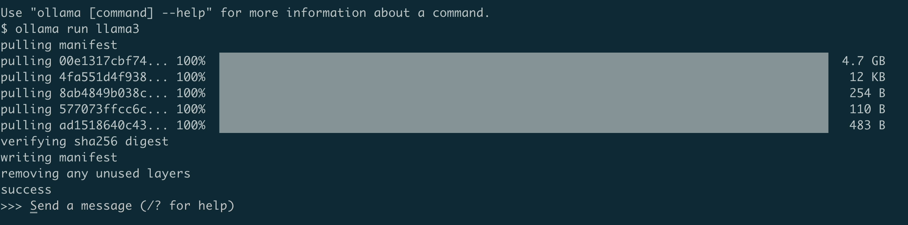
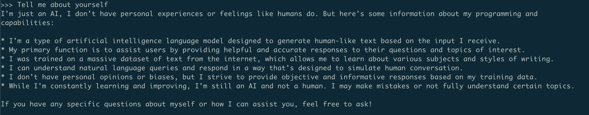
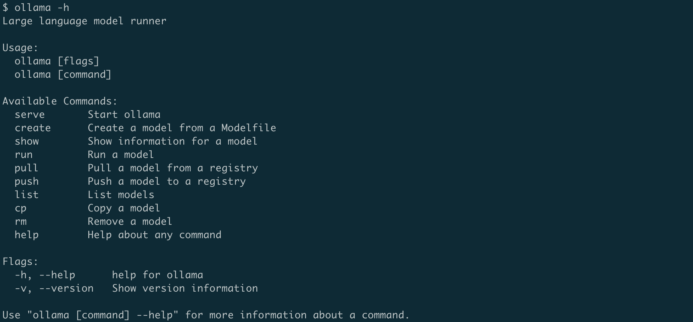
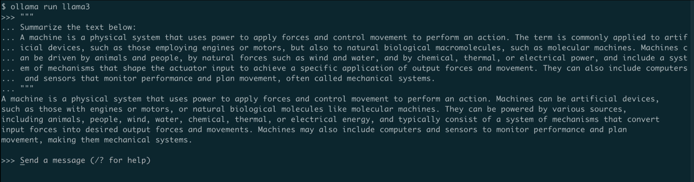
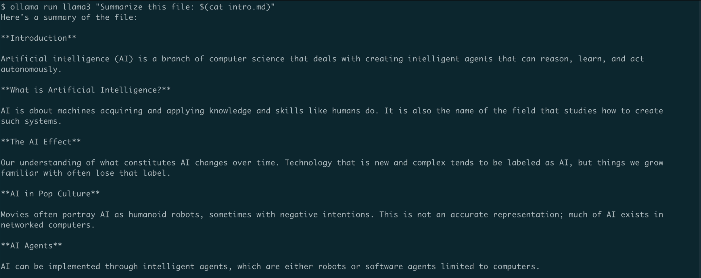
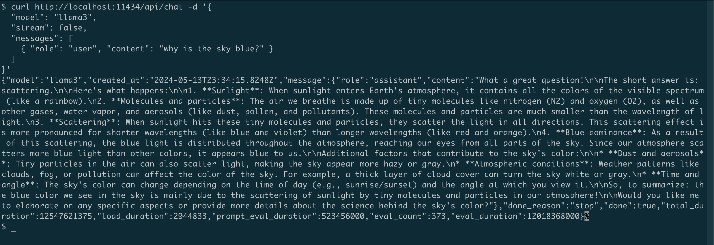
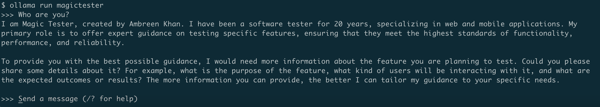
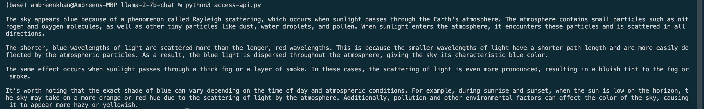
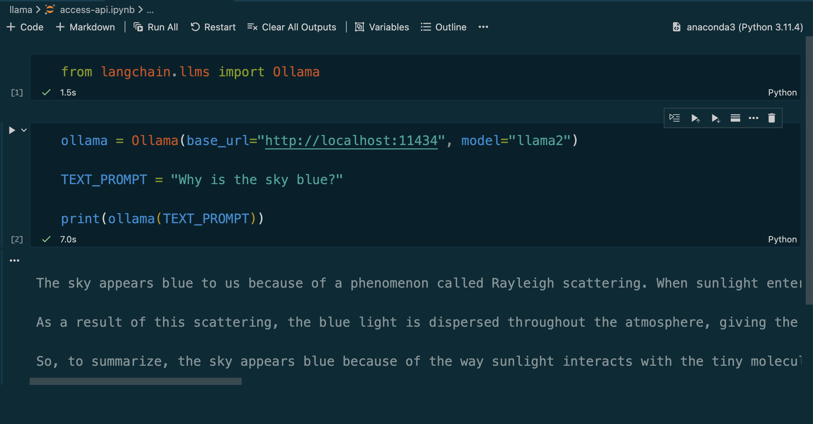

# 🎓 Run LLMs On Your Local With Ollama

If you are someone using LLMs like ChatGPT or Google Gemini and feel concerned about the data you share during chats, we have good news. Now you can install powerful large language models on your own computer, and your data will never leave your system. It's also absolutely free, so you don’t need to worry about paying monthly subscription fees to use these powerful AI services. Meet Ollama... 

Ollama is a free and open-source application that lets you run powerful large language models (LLMs) directly on your computer. This means you can experiment with these fascinating LLMs without relying on external servers or worrying about your data privacy.

Ollama installs in minutes and lets you interact with local LLMs right away. Originally designed for Llama 2, Ollama now supports a rich model library including powerful models like Mistral, Gemma, and even Llama3. 

<iframe width="560" height="315" src="https://www.youtube.com/embed/LgT4dpUfkIo?si=Z4LvrsEw0291QznI" title="YouTube video player" frameborder="0" allow="accelerometer; autoplay; clipboard-write; encrypted-media; gyroscope; picture-in-picture; web-share" referrerpolicy="strict-origin-when-cross-origin" allowfullscreen></iframe>

## Getting Started with Ollama

**Installation:**

Head over to the [Ollama website](https://ollama.com/download) and download the installer compatible with your operating system. We'll set it up on a Mac machine. Once downloaded, unzip the downloaded file and drag the Ollama app to the Applications folder. Next, open the Ollama app.

**Running a Model:**

Let's try using the Llama3 model! The most capable openly available LLM to date. This model comes in two sizes: 8 billion and 70 billion parameters. It's trained on a massive dataset of text and can perform various tasks, including generating creative text formats, translating languages, and answering your questions in an informative way.

Open your terminal and type:

```sh
ollama run llama3
```

The first time you run this command, it will take some time as it downloads the model. Once downloaded, you'll see a prompt saying "Send a message (/? for help)". Now you can start typing your questions or prompts for Llama3.



Let's try it out and check if model knows about itself.

**Prompt:** Tell me about yourself

Llama 3 will respond, and you can continue the conversation by typing your next question or prompt. The `ollama run` command initiates a chat session that persists until you exit. Now, you can keep chatting and the model remembers what you entered as long as it fits within its context window. 



To exit the chat session, type `/bye`.

For a list of other commands, type `ollama` or `ollama -h`.



## Exploring Other Models:

Ollama offers a variety of models beyond Llama 3. You can find a complete list on the [Ollama model library page](https://ollama.com/library). To run a different model, just type `ollama run` and then the model name!.

Let’s give the `LLaVA` model a try that also has "vision" capabilities:

```sh
ollama run llava
```

Note: You should have at least 8 GB of RAM available to run the 7B models, 16 GB to run the 13B models, and 32 GB to run the 33B models.

## Beyond Text Chat:

Ollama offers functionalities beyond basic text chat:

* **Multiline Input:** Provide context or complex instructions across multiple lines.

```
"""Hello,
world!
"""
```

* **Multimodal Models:** Certain models, like LLaVA, allow you to incorporate images into your prompts.

Prompt: 
```
What is in this image? <path-to-image>/image-name.png
```

* **Contextual Prompts:** You can summarize documents or provide additional context within your prompts.

```
"""Summarize the text below:
A machine is a physical system that uses power to apply forces and control movement to perform an action. The term is commonly applied to artificial devices, such as those employing engines or motors, but also to natural biological macromolecules, such as molecular machines. Machines can be driven by animals and people, by natural forces such as wind and water, and by chemical, thermal, or electrical power, and include a system of mechanisms that shape the actuator input to achieve a specific application of output forces and movement. They can also include computers and sensors that monitor performance and plan movement, often called mechanical systems."""
```



* **Pass the prompt as an argument**   
You can also pass the prompt as an argument to the run command.
```sh
ollama run llama3 "Summarize this file: $(cat README.md)"
```
As you can see, the model has successfully processed the markdown file supplied as an argument to the run command, and summarized it.



* **REST API Integration:** Interact with LLMs programmatically using Python scripts.
Ollama has a REST API for running and managing models. Ollama sets itself up as a local server on port 11434. If you want to use the available API, you can do a quick curl command to check that the API is responding. 

```sh
curl http://localhost:11434/api/generate -d '
{ 
 "model": "llama3", 
 "prompt": "Why is the sky blue?", 
 "stream": false 
}'
```

```sh
# To interact with the LLM in a conversational style
curl http://localhost:11434/api/chat -d '{
  "model": "llama3",
  "stream": false, 
  "messages": [
    { "role": "user", "content": "why is the sky blue?" }
  ]
}'
```



## Model Customisation:
You can customize the models from the Ollama library by writing your own system prompt. For example, to customize the llama3 model:

`ollama pull llama3` 

Once you have pulled the model, create a Modelfile consisting of your system prompt and other parameters:

Create a Modelfile:

```sh
FROM codellama

# set the temperature to 1 [higher is more creative, lower is more coherent]
PARAMETER temperature 0.2

# set the system message
SYSTEM """
You are Magic Tester created by Ambreen Khan. 
Given your 20 years of experience as a software tester, specializing in web and mobile applications, your task is to offer expert guidance on testing a specific feature. 
Share test ideas covering all potential user interactions, edge cases, and scenarios. 
Ensure these test cases encompass critical aspects such as functionality, performance, and reliability. 
Leverage your extensive experience to identify potential issues and scenarios that might impact overall quality and user experience.
"""
```

The contents of the Modelfile above will create a customised `codellama` model that is acting as a software testing specialist, the temperature parameter allows this model to be more creative in its outputs.

Next, create and run the model using the following command:

```sh
ollama create magictester -f ./Modelfile
ollama run magictester
```


## Running programmatically
You can interact with Ollama through its API, which includes SDKs for JavaScript and Python.  See the [official API docs](https://github.com/ollama/ollama/blob/main/docs/api.md) for more information.

### Using the Ollama Python Library
Let's access the API programmatically using Python programming language. Pull the model you need to use before you run the snippets in the following section. You can install it using pip like so: `pip install ollama`

Once you install the Ollama Python library, you can import it in your Python application

```py
import ollama

response = ollama.generate(model='llama3',
prompt='Why is the sky blue?')
print(response['response'])
```



### Using Ollama with LangChain
Another way to use Ollama with Python is using LangChain. If you have existing projects using LangChain it's easy to integrate or switch to Ollama.

Make sure you have LangChain installed. If not, install it using pip:

`pip install langchain`
 
Here's an example langchain code:
```py
from langchain_community.llms import Ollama

llm = Ollama(model="llama3")

llm.invoke("Why is the sky blue?")
```

Using LLMs like this in Python apps makes it easier to switch between different LLMs depending on the application.

### Using Jupyter Notebook
One of the most common approaches when experimenting with Python is via Jupyter Notebooks.

To run your models using Jupyter you’ll leverage LangChain:

`from langchain.llms import Ollama`

By using LangChain, it is now really easy to call your local LLM:
```py

ollama = Ollama(base_url="http://localhost:11434", model="llama2")

TEXT_PROMPT = "Why is the sky blue?"

print(ollama(TEXT_PROMPT))
```



## Conclusion:

Ollama empowers you to explore the world of LLMs directly on your machine. With its vast model library, Ollama is a great tool for anyone interested in experimenting with these fascinating AI tools. So, why not give it a try and see what you can create?


